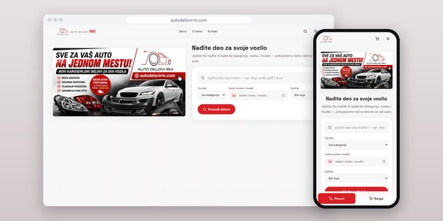
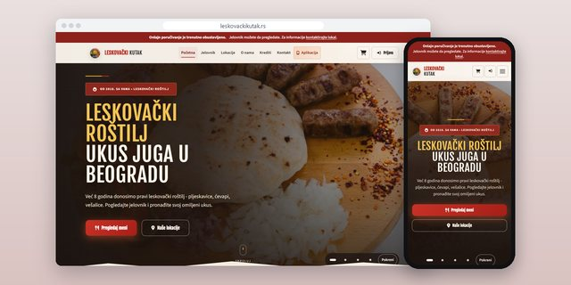
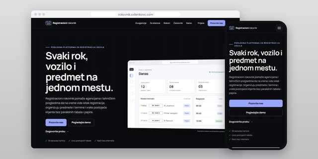
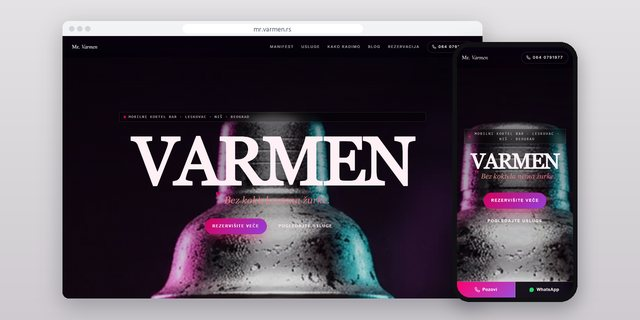
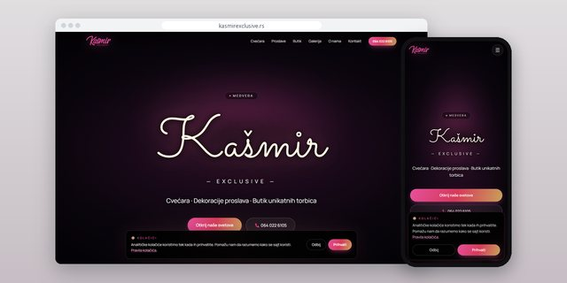
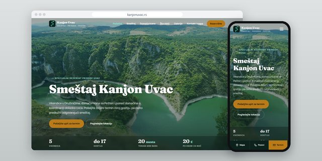

### D. Svilenković

I design, build and host websites and web apps for businesses in Serbia. Most of my clients are small companies that need a fast site, a simple way to take inquiries or orders, and someone who keeps it all running after launch.

Every project below has its own repository with screenshots, the stack, measured results and a link to the live site. The code itself stays private, because it belongs to the clients.

[svilenkovic.com](https://svilenkovic.com) · [dimitrije@svilenkovic.com](mailto:dimitrije@svilenkovic.com) · [Srpski](README.sr.md)

#### Selected work

<table>
  <tr>
    <td width="33%" valign="top"> <b><a href="https://github.com/Svilenkovic/auto-delovi-rm-case-study">Auto Delovi RM</a></b> Car body parts shop, Zaječar</td>
    <td width="33%" valign="top"> <b><a href="https://github.com/Svilenkovic/leskovacki-kutak-case-study">Leskovački Kutak</a></b> Grill restaurant with delivery, Belgrade</td>
    <td width="33%" valign="top"> <b><a href="https://github.com/Svilenkovic/rokovnik-case-study">Registracioni rokovnik</a></b> Software for registration agencies</td>
  </tr>
  <tr>
    <td width="33%" valign="top"> <b><a href="https://github.com/Svilenkovic/mr-varmen-case-study">Mr. Varmen</a></b> Mobile cocktail bar, Leskovac</td>
    <td width="33%" valign="top"> <b><a href="https://github.com/Svilenkovic/kasmir-exclusive-case-study">Kašmir Exclusive</a></b> Florist and event decoration, Medveđa</td>
    <td width="33%" valign="top"> <b><a href="https://github.com/Svilenkovic/kanjon-uvac-case-study">Kanjon Uvac</a></b> Rural cabins, Sjenica</td>
  </tr>
</table>

<b>All projects (47)</b>

**Web shops**

| Project | What it is | Live |
| :-- | :-- | :-- |
| [Auto Delovi RM](https://github.com/Svilenkovic/auto-delovi-rm-case-study) | Car body parts shop, Zaječar | [autodelovirm.com](https://autodelovirm.com/) |
| [Shadow Style Shop](https://github.com/Svilenkovic/shadow-style-shop-case-study) | T-shirt print shop, Serbia | [shadowstyleshop.rs](https://shadowstyleshop.rs/) |
| [Hemax Pro Wash](https://github.com/Svilenkovic/hemax-pro-wash-case-study) | Cleaning chemicals shop, Leskovac | [hemaxprowash.com](https://hemaxprowash.com/) |
| [Prva Lekcija](https://github.com/Svilenkovic/prva-lekcija-case-study) | Matura exam prep, Zagreb | [prvalekcija.com](https://prvalekcija.com/) |

**Portals and ordering platforms**

| Project | What it is | Live |
| :-- | :-- | :-- |
| [Leskovački Kutak](https://github.com/Svilenkovic/leskovacki-kutak-case-study) | Grill restaurant with delivery, Belgrade | [leskovackikutak.rs](https://leskovackikutak.rs/) |
| [Klasičan Gejming](https://github.com/Svilenkovic/klasican-gejming-case-study) | Gaming news portal, Serbia | [klasicangejming.com](https://klasicangejming.com/) |
| [KG Loot](https://github.com/Svilenkovic/kg-loot-case-study) | Gaming gear marketplace, Serbia | [loot.klasicangejming.com](https://loot.klasicangejming.com/) |

**Business websites**

| Project | What it is | Live |
| :-- | :-- | :-- |
| [ARHIFARM](https://github.com/Svilenkovic/arhifarm-case-study) | Industrial cleaning and diagnostics, custom CMS | [arhifarm.rs](https://arhifarm.rs/) |
| [SRMEK](https://github.com/Svilenkovic/srmek-case-study) | Quality association, Kragujevac | [srmek.org](https://srmek.org/) |
| [Zadužbina Jovo Lojanica Stupljanin](https://github.com/Svilenkovic/zaduzbina-lojanica-case-study) | Research endowment, Sjenica | [zaduzbinalojanica.rs](https://zaduzbinalojanica.rs/) |
| [Nora Perfekt](https://github.com/Svilenkovic/nora-perfekt-case-study) | Cleaning and paving, Serbia | [noraperfekt.rs](https://noraperfekt.rs/) |
| [Medica Centar](https://github.com/Svilenkovic/medica-centar-case-study) | Gynecology practice, Niš | [medicacentar.info](https://medicacentar.info/) |
| [La Sylphide](https://github.com/Svilenkovic/la-sylphide-case-study) | Ballet school, Novi Sad | [ballet-dobrilanovkov.com](https://www.ballet-dobrilanovkov.com/) |
| [Green Plus](https://github.com/Svilenkovic/green-plus-case-study) | Reactive power compensation, Belgrade | [greenplus.rs](https://greenplus.rs/) |
| [Glass Service Bošnjace](https://github.com/Svilenkovic/glass-service-bosnjace-case-study) | Auto glass shop, Leskovac | [glassbosnjace.rs](https://glassbosnjace.rs/) |
| [AutoSet Niš](https://github.com/Svilenkovic/autoset-nis-case-study) | Auto glass shop, Niš | [autoset.rs](https://autoset.rs/) |
| [Zlaja 2015](https://github.com/Svilenkovic/vodoinstalater-zlaja-case-study) | Plumber and electrician, Belgrade | [vodoinstalaterzlaja2015.rs](https://vodoinstalaterzlaja2015.rs/) |
| [Tehnički Pregled Stanković 964](https://github.com/Svilenkovic/tehnicki-pregled-stankovic-case-study) | Vehicle inspection station, Aleksinac | [stankovic964.rs](https://stankovic964.rs/) |
| [Klimatronik 016](https://github.com/Svilenkovic/klimatronik-016-case-study) | Air conditioning service, Leskovac | [klimatronik.rs](https://klimatronik.rs/) |
| [3D Art Kragujevac](https://github.com/Svilenkovic/3d-art-kragujevac-case-study) | Sign workshop, Kragujevac | [svetlecereklame3dart.rs](https://svetlecereklame3dart.rs/) |
| [Jupiter Planet](https://github.com/Svilenkovic/jupiter-planet-case-study) | Print and embroidery workshop, Kragujevac | [jupiterplanet.rs](https://jupiterplanet.rs/) |
| [Denis Market 97](https://github.com/Svilenkovic/denis-market-97-case-study) | Grocery store and filo pastry, Nikolinci | [denismarket.rs](https://denismarket.rs/) |
| [Golden Pets Hotel](https://github.com/Svilenkovic/golden-pets-hotel-case-study) | Boarding for small dogs, Belgrade | [hotelpansionzapse.com](https://www.hotelpansionzapse.com/) |
| [Trubači Stars](https://github.com/Svilenkovic/trubaci-stars-case-study) | Brass band, Leskovac | [trubacizaslavlja.rs](https://trubacizaslavlja.rs/) |
| [Trubači Stars Beograd](https://github.com/Svilenkovic/trubaci-stars-svadbe-case-study) | Brass band, Belgrade | [trubaci-trubacizasvadbe.rs](https://trubaci-trubacizasvadbe.rs/) |
| [Mr. Varmen](https://github.com/Svilenkovic/mr-varmen-case-study) | Mobile cocktail bar, Leskovac | [mr.varmen.rs](https://mr.varmen.rs/) |
| [Kašmir Exclusive](https://github.com/Svilenkovic/kasmir-exclusive-case-study) | Florist and event decoration, Medveđa | [kasmirexclusive.rs](https://kasmirexclusive.rs/) |
| [Villa Bella Vista](https://github.com/Svilenkovic/villa-bella-vista-case-study) | Holiday apartments, Divčibare | [villabellavista.rs](https://villabellavista.rs/) |
| [Kanjon Uvac](https://github.com/Svilenkovic/kanjon-uvac-case-study) | Rural cabins, Sjenica | [kanjonuvac.rs](https://kanjonuvac.rs/) |
| [Kuća Kranjanac](https://github.com/Svilenkovic/kuca-kranjanac-case-study) | Guest rooms, Boljevac | [kranjanac.svilenkovic.rs](https://kranjanac.svilenkovic.rs/) |
| [Kraljevi Čardaci 11/61](https://github.com/Svilenkovic/kraljevi-cardaci-case-study) | Apartment for sale and rent, Kopaonik | [kraljevicardaci.svilenkovic.rs](https://kraljevicardaci.svilenkovic.rs/) |
| [Diamond Lux Kopaonik](https://github.com/Svilenkovic/diamond-lux-kopaonik-case-study) | Holiday apartment, Kopaonik | [diamondlux.svilenkovic.rs](https://diamondlux.svilenkovic.rs/) |
| [Halo City Leskovac](https://github.com/Svilenkovic/halo-city-leskovac-case-study) | Phone shop and repair, Leskovac | [halocity.svilenkovic.rs](https://halocity.svilenkovic.rs/) |
| [Aleksa Insajder](https://github.com/Svilenkovic/aleksa-insajder-case-study) | Sports content creator, Serbia | [aleksainsajder.rs](https://aleksainsajder.rs/) |
| [Bata Stanković PR](https://github.com/Svilenkovic/bata-stankovic-case-study) | Bookkeeping agency, Lebane | [batastankovic.com](https://batastankovic.com/) |
| [Detailing 016](https://github.com/Svilenkovic/detailing-016-case-study) | Car detailing studio, Leskovac | [detailing016.rs](https://detailing016.rs/) |
| [Ivković Prevoz](https://github.com/Svilenkovic/ivkovic-prevoz-case-study) | Firewood, freight and towing, Leskovac | [ivkovicprevoz.rs](https://ivkovicprevoz.rs/) |
| [Milan Vlasić](https://github.com/Svilenkovic/milan-vlasic-case-study) | Real estate agent, Sydney and Belgrade | [bre.rs](https://bre.rs/) |
| [Duca Dizajn](https://github.com/Svilenkovic/duca-dizajn-case-study) | Graphic design portfolio, Novi Sad | [ducadizajn.svilenkovic.com](https://ducadizajn.svilenkovic.com/) |

**Web apps and tools**

| Project | What it is | Live |
| :-- | :-- | :-- |
| [Registracioni rokovnik](https://github.com/Svilenkovic/rokovnik-case-study) | Software for registration agencies | [rokovnik.svilenkovic.com](https://rokovnik.svilenkovic.com/) |
| [Kompres](https://github.com/Svilenkovic/kompres-case-study) | Image compression in the browser | [compress.svilenkovic.rs](https://compress.svilenkovic.rs/) |
| [Svilenkovic Mail](https://github.com/Svilenkovic/svilenkovic-mail-case-study) | Webmail with an Android app | [mail.svilenkovic.com](https://mail.svilenkovic.com/) |
| [Admin Panel](https://github.com/Svilenkovic/sites-panel-case-study) | Internal hosting panel | [product page](https://svilenkovic.com/en/aplikacija-admin-panel) |
| [Digitalna pozivnica](https://github.com/Svilenkovic/digital-invitation-case-study) | Digital invitation for private events | [product page](https://svilenkovic.com/en/aplikacija-digitalna-pozivnica) |

**Own demos and concepts**

| Project | What it is | Live |
| :-- | :-- | :-- |
| [DJ Njace](https://github.com/Svilenkovic/dj-njace-case-study) | DJ website demo, Vranje | [djnjace.svilenkovic.rs](https://djnjace.svilenkovic.rs/) |
| [Balkan RP](https://github.com/Svilenkovic/balkan-roleplay-case-study) | FiveM roleplay site demo | [rp.svilenkovic.rs](https://rp.svilenkovic.rs/) |
| [FOX Models](https://github.com/Svilenkovic/fox-models-case-study) | Modeling agency concept, Belgrade | [models.svilenkovic.rs](https://models.svilenkovic.rs/) |

#### How a project runs

1. **Research.** Before any design I look at the business, its customers and what people in that area actually search for.
2. **Design and build.** Hand-written PHP for most sites, Next.js or Astro where a site needs motion or 3D, and a small admin panel when the client wants to edit things alone.
3. **Content and SEO.** Real texts and photos from the client, structured data, a sitemap and Search Console from the first day.
4. **Checks before launch.** Phone widths from 320 px, keyboard and screen reader basics, security headers, HTML validation and PageSpeed on the live site.
5. **Hosting and upkeep.** The sites run on my own server with nginx, PHP-FPM, MariaDB, DNS and mail. Every change is backed up first and kept in a private repository.

#### Stack

PHP 8.3 · MariaDB · SQLite · Next.js · React · Astro · three.js · GSAP · nginx · Ubuntu

#### About the code

Client work belongs to the clients, so the source code lives in private repositories. The repositories here only document the projects. If you want to know how something was built, write to me.
